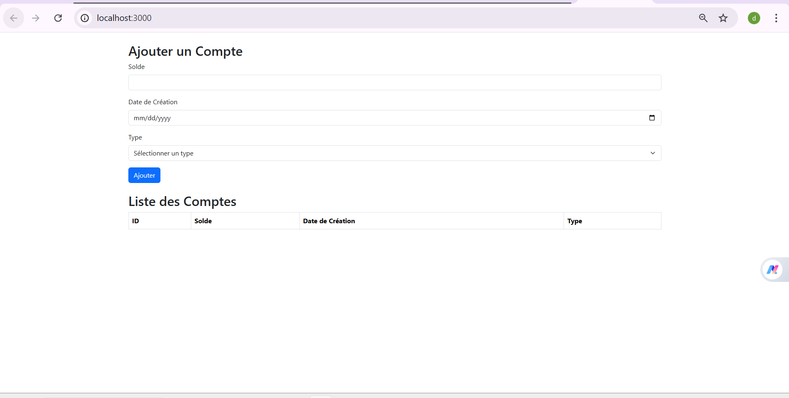

# Application Compte Client

Application React pour la gestion des comptes clients.

## Installation

1. Installer les dépendances :
```bash
npm install
```

## Démarrage

Démarrer l'application en mode développement :
```bash
npm start
```

L'application sera disponible sur [http://localhost:3000](http://localhost:3000).

## Configuration

L'URL de l'API backend est configurée dans `src/config.js`. Par défaut, elle pointe vers `http://localhost:8082/api`.

## Fonctionnalités

- Affichage de la liste des comptes
- Ajout de nouveaux comptes via un formulaire
- Interface utilisateur avec Bootstrap

## 🖥️ Frontend – Account Management Interface

The following screenshot illustrates the frontend interface developed with
**React** for bank account management.

The interface provides:
- A form to create a new account (balance, creation date, account type)
- A table displaying the list of accounts with their ID, balance, creation date,
  and type

This frontend communicates with the Spring Boot REST API to perform CRUD
operations on accounts.


